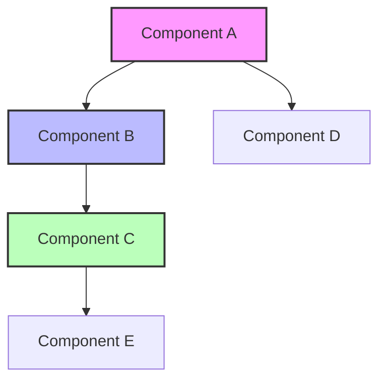
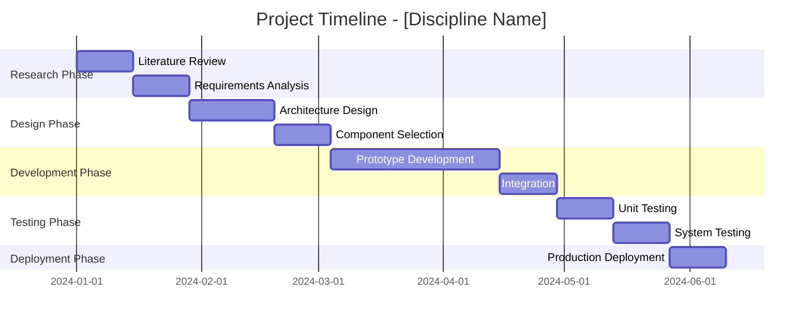
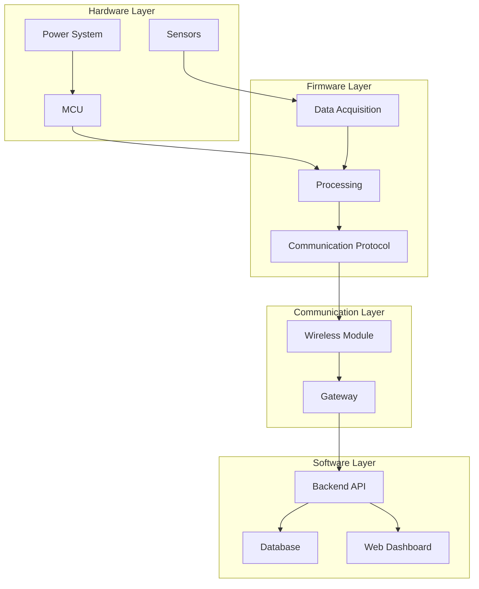
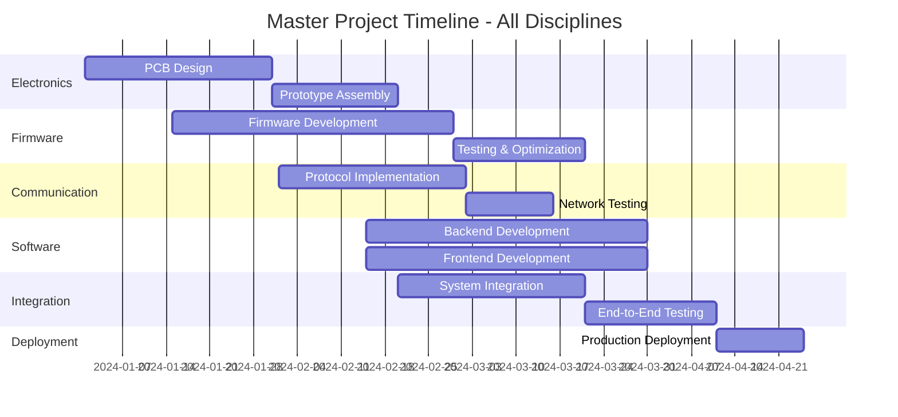

# Research Documentation Prompt Template

## Overview
This template provides a comprehensive framework for conducting multidisciplinary research on technical topics. It guides you through analyzing a topic across multiple engineering and management disciplines, complete with theory, case studies, diagrams, timelines, and animations.

---

## How to Use This Template

1. Replace `[Insert your research topic here]` with your specific topic
2. The system will automatically identify relevant disciplines
3. Irrelevant disciplines will be skipped
4. Each relevant discipline will be analyzed in depth
5. Final compilation will integrate all findings

---

## Research Prompt

**Topic:** [Insert your research topic here]

**Example:** "Ultra low powered data logger for water utilities"

---

### Phase 1: Discipline Identification

Analyze the above topic and identify which of the following disciplines are relevant:

- Mechanical Engineering
- Electronic Engineering
- Wireless Communication
- Firmware Development
- Software Development
- Server Infrastructure
- Chemistry
- Biology
- Project Management
- Maintenance Process
- [Other relevant disciplines]

**Note:** Only proceed with disciplines that have meaningful relevance (>10% contribution to project). Skip disciplines that are not applicable.

---

### Phase 2: Discipline Deep-Dive

For each **relevant discipline only**, provide the following:

#### 1. Theory, Formula & Concepts

**Required Elements:**
- Core theoretical foundations
- Relevant formulas and equations (use LaTeX notation)
- Key concepts and principles
- Design considerations and constraints

**Research Resources:**
- Academic papers (with DOI/URLs)
- Textbooks and reference books
- Industry standards (IEEE, ISO, etc.)
- Technical documentation
- Online courses or tutorials

**Manim Animation (if relevant):**
Provide Python Manim code to visualize:
- Mathematical formulas and derivations
- Physical phenomena
- Theoretical concepts
- Signal behavior or wave propagation

```python
# Example Manim code structure
from manim import *

class ConceptVisualization(Scene):
    def construct(self):
        # Animation code here
        pass
```

---

#### 2. Previous Case Studies

**Required Elements:**
- Summary of 3-5 relevant case studies
- Implementation details
- Key findings and outcomes
- Performance metrics
- Lessons learned
- Comparative analysis

**Research Resources:**
- Links to case study publications
- White papers
- Industry reports
- Conference proceedings (IEEE, ACM, etc.)
- Company technical blogs
- GitHub repositories (if applicable)

**Format:**

| Case Study | Organization | Year | Key Technology | Outcome | Link |
|------------|--------------|------|----------------|---------|------|
| Study 1 | Company/Org | YYYY | Tech used | Results | [Link]() |
| Study 2 | Company/Org | YYYY | Tech used | Results | [Link]() |

---

#### 3. Suggestions with Block Diagram

**Required Elements:**
- Proposed approach/solution
- Technical specifications
- Component selection rationale
- Implementation strategy
- Design trade-offs

**Block Diagram (Markdown ASCII):**
```
┌─────────────┐      ┌─────────────┐      ┌─────────────┐
│ Component A │─────▶│ Component B │─────▶│ Component C │
└─────────────┘      └─────────────┘      └─────────────┘
       │                                          │
       │                                          │
       ▼                                          ▼
┌─────────────┐                          ┌─────────────┐
│ Component D │                          │ Component E │
└─────────────┘                          └─────────────┘
```

**Mermaid Diagram:**


**Manim Animation (if relevant):**
Provide Python Manim code to animate:
- System architecture and data flow
- Component interactions
- Process workflows
- State transitions

```python
# Example Manim code for system workflow
from manim import *

class SystemWorkflow(Scene):
    def construct(self):
        # Animation showing data flow through system
        pass
```

---

#### 4. Timeline

**Table Format:**

| Phase | Task Description | Duration | Start Date | End Date | Dependencies | Deliverables | Responsible Team |
|-------|------------------|----------|------------|----------|--------------|--------------|------------------|
| 1 | Research & Planning | 2 weeks | DD/MM/YYYY | DD/MM/YYYY | None | Requirements Doc | Research Team |
| 2 | Design | 4 weeks | DD/MM/YYYY | DD/MM/YYYY | Phase 1 | Design Specs | Engineering Team |
| 3 | Prototype | 6 weeks | DD/MM/YYYY | DD/MM/YYYY | Phase 2 | Working Prototype | Dev Team |
| 4 | Testing | 3 weeks | DD/MM/YYYY | DD/MM/YYYY | Phase 3 | Test Reports | QA Team |
| 5 | Deployment | 2 weeks | DD/MM/YYYY | DD/MM/YYYY | Phase 4 | Production System | Ops Team |

**Gantt Chart (Mermaid):**


---

### Phase 3: Final Compilation

After completing all discipline analyses, create a comprehensive **Final Documentation** that includes:

#### 1. Executive Summary
- Project overview (2-3 paragraphs)
- Objectives and scope
- Key findings across all disciplines
- Recommended approach
- Expected outcomes and impact
- Critical success factors

#### 2. Integrated System Architecture

**System-Level Block Diagram:**
Show how all disciplines integrate together



**Manim Animation:**
Provide comprehensive Python Manim code showing:
- Complete system operation
- Data flow across all layers
- Interaction between disciplines
- Real-time operation simulation

```python
# Example Master System Animation
from manim import *

class IntegratedSystemAnimation(Scene):
    def construct(self):
        # Complete system animation
        # Show data flow from sensors to cloud
        # Demonstrate all discipline interactions
        pass
```

#### 3. Consolidated Master Timeline

**Master Project Gantt Chart:**


**Critical Path Analysis:**
- Identify critical path items
- Buffer time allocation
- Risk mitigation for delays

#### 4. Risk Assessment Matrix

| Discipline | Risk Description | Impact (1-5) | Probability (1-5) | Risk Score | Mitigation Strategy | Contingency Plan |
|------------|------------------|--------------|-------------------|------------|---------------------|------------------|
| Electronics | Component shortage | 4 | 3 | 12 | Multiple suppliers | Alternative components |
| Firmware | Memory limitations | 3 | 2 | 6 | Code optimization | Upgrade MCU |
| Communication | Network coverage | 5 | 3 | 15 | Site survey | Alternative protocol |
| Software | Scalability issues | 4 | 2 | 8 | Cloud architecture | Load balancing |

**Risk Categories:**
- Technical risks
- Schedule risks
- Resource risks
- External dependency risks

#### 5. Budget Estimation

| Category | Item | Quantity | Unit Cost | Total Cost | Notes |
|----------|------|----------|-----------|------------|-------|
| Hardware | Development boards | 10 | $50 | $500 | Prototyping |
| Components | Sensors, modules | Various | - | $2,000 | Electronics |
| Software | Cloud services | 12 months | $200/mo | $2,400 | Infrastructure |
| Labor | Engineering team | - | - | $50,000 | Development |
| Testing | Test equipment | - | - | $5,000 | QA |
| Documentation | Technical writing | - | - | $3,000 | Documentation |
| **Total** | | | | **$62,900** | |

**Budget Breakdown:**
- Development costs
- Operational costs
- Maintenance costs
- Contingency (typically 10-20%)

#### 6. Complete Bibliography

**Organized by Discipline:**

##### Electronics
1. Author, A. (Year). Title. *Journal*. DOI: [link]
2. Author, B. (Year). Title. *Conference*. [link]

##### Firmware
1. Author, C. (Year). Title. *Publisher*. [link]
2. Author, D. (Year). Title. *Journal*. [link]

##### [Continue for each discipline]

**Resource Types:**
- Academic papers
- Books and textbooks
- Standards documents
- Technical reports
- Online resources
- GitHub repositories

#### 7. Appendices

**Appendix A: Detailed Calculations**
- Power consumption analysis
- Signal strength calculations
- Cost-benefit analysis

**Appendix B: Additional Diagrams**
- Detailed circuit schematics
- Data flow diagrams
- Sequence diagrams

**Appendix C: Code Samples**
- Critical algorithm implementations
- Configuration examples
- API documentation

**Appendix D: Test Results**
- Performance benchmarks
- Validation data
- Comparison tables

#### 8. Animation Gallery

Collection of all Manim animations with descriptions:

**Animation 1: [Discipline] - [Concept Name]**
- Description: Brief explanation of what the animation shows
- Key Points: Main takeaways
- Code:
```python
# Manim code here
```

**Animation 2: [Discipline] - [Concept Name]**
- Description: Brief explanation
- Key Points: Main takeaways
- Code:
```python
# Manim code here
```

---

## Output Format Requirements

### Markdown Document
- Complete structured documentation in `.md` format
- Valid Markdown syntax
- Embedded Mermaid diagrams
- Code blocks for Manim animations
- Properly formatted tables
- Hierarchical heading structure

### Word Document (.docx)
The final documentation should be convertible to Word format with:
- Professional formatting
- Table of contents with page numbers
- Consistent heading styles
- Embedded diagrams (rendered from Mermaid)
- Code blocks with syntax highlighting
- Page headers and footers
- Cover page with title and date
- Section breaks between major parts

### Diagram Formats
- **Mermaid:** For flowcharts, Gantt charts, system diagrams
- **Markdown ASCII:** For simple block diagrams
- **Manim Python:** For animated visualizations

---

## Example Application

**Topic Input:** "Ultra low powered data logger for water utilities"

**Expected Relevant Disciplines:**
- ✅ Electronic Engineering (power systems, sensors, MCU selection)
- ✅ Wireless Communication (LoRaWAN, NB-IoT protocols)
- ✅ Firmware Development (sleep modes, data compression)
- ✅ Software Development (dashboard, analytics)
- ✅ Server Infrastructure (cloud, database)
- ✅ Chemistry (water quality parameters)
- ✅ Project Management (timeline, resources)
- ✅ Maintenance Process (calibration, troubleshooting)
- ❌ Biology (not relevant - skipped)
- ❌ Mechanical Engineering (minimal - brief mention only)

---

## Notes and Best Practices

1. **Discipline Selection:** Only include disciplines with meaningful contribution (>10% to project success)
2. **Research Resources:** Provide actual, clickable links whenever possible
3. **Diagrams:** Ensure all Mermaid diagrams use valid syntax and render correctly
4. **Timeline:** Should span realistic project duration (typically 6-24 months)
5. **Manim Animations:** Include only when they add significant value to understanding
6. **Final Document:** Should be publication-ready and professional

---

## Validation Checklist

Before finalizing the research documentation, verify:

- [ ] All relevant disciplines identified and analyzed
- [ ] Irrelevant disciplines properly skipped
- [ ] Theory section includes formulas and research resources
- [ ] At least 3 case studies per discipline with links
- [ ] Block diagrams provided in both markdown and Mermaid
- [ ] Manim animations included where relevant
- [ ] Timeline includes both table and Gantt chart
- [ ] Final compilation integrates all disciplines
- [ ] Master timeline shows critical path
- [ ] Risk assessment is comprehensive
- [ ] Budget estimation is realistic
- [ ] Bibliography is complete and properly formatted
- [ ] All Mermaid diagrams render correctly
- [ ] All links are valid and accessible
- [ ] Document is ready for .docx conversion

---

## Version Control

- **Version:** 1.0
- **Last Updated:** [Date]
- **Author:** [Your Name]
- **Repository:** [GitHub Link]

---

## License

[Specify your license here, e.g., MIT, CC-BY-4.0, etc.]

---

## Contributing

Contributions to improve this template are welcome! Please:
1. Fork the repository
2. Create a feature branch
3. Submit a pull request with clear description

---

## Contact

For questions or suggestions:
- **Email:** [your-email@example.com]
- **GitHub Issues:** [link to issues page]
- **Documentation:** [link to wiki or docs]
